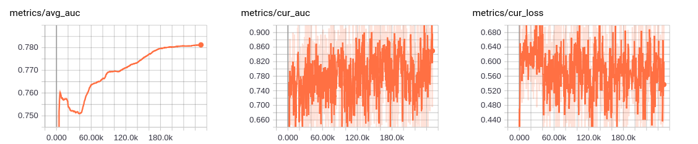

# DeepFM
Implementation of [DeepFM: A Factorization-Machine based Neural Network for CTR Prediction](https://arxiv.org/pdf/1703.04247.pdf)

### Environment
- Python3.5
- Tensorflow 1.2.1

### Dataset
[MovieLens](http://files.grouplens.org/datasets/movielens/ml-20m.zip) processed with ./utils/sort_movies_len.ipynb

### Run
```
cd scripts
sh run_deepfm.sh
```

Or
```
export PYTHONPATH="$PYTHONPATH:/home/xtzhao/Projects/Python"
/home/xtzhao/anaconda3/envs/env_tf1.2.1_on_cpu/bin/python run.py --exp_name=deepfm_test
```
'/home/xtzhao/Projects/Python' is Parent directory of './deep_fm'

### Results


```
/home/xtzhao/anaconda3/envs/env_tf1.2.1_on_cpu/bin/tensorboard --port=8085 --logdir=./data/log/deepfm
```
